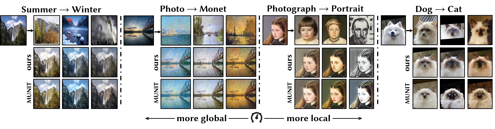

[](https://raw.githubusercontent.com/NVIDIA/FastPhotoStyle/master/LICENSE.md)




# Domain-Specific Mappings for Generative Adversarial Style Transfer
[[Project Page]](http://acht7111020.github.io/DSMAP-demo)[[Paper]](https://arxiv.org/abs/2008.02198)

Pytorch implementation for our paper **Domain-Specific Mappings for Generative Adversarial Style Transfer**.

## Example Results


## Paper
Domain-Specific Mappings for Generative Adversarial Style Transfer<br>
[Hsin-Yu Chang](https://github.com/acht7111020), [Zhixiang Wang](http://homepage.ntu.edu.tw/~r06944046/), and [Yung-Yu Chuang](https://www.csie.ntu.edu.tw/~cyy/)<br>
European Conference on Computer Vision (ECCV), 2020<br>
[[arxiv]](https://arxiv.org/abs/2008.02198)

## Citation
If you find the work is useful in your research, please consider citing:
```
@inproceedings{chang2020dsmap,
    author    = {Chang, Hsin-Yu and Wang, Zhixiang and Chuang, Yung-Yu},
    title     = {Domain-Specific Mappings for Generative Adversarial Style Transfers},
    booktitle = {European Conference on Computer Vision},
    year      = {2020}
```

## Usage

### Requirements
1. Python 3.6 or higher
2. Pytorch 1.2.0 or higher, torchvision 0.4.0 or higher
3. Tensorboard, TensorboardX, Pyyaml, pillow

### Dataset
Download dataset from the following github repo.
* [Cat2Dog (DRIT)](https://github.com/HsinYingLee/DRIT)
* [Portrait (DRIT)](https://github.com/HsinYingLee/DRIT)
* [Monet (CycleGAN)](https://github.com/junyanz/pytorch-CycleGAN-and-pix2pix)
* [Yosemite (CycleGAN)](https://github.com/junyanz/pytorch-CycleGAN-and-pix2pix)

### Train
```
CUDA_VISIBLE_DEVICES=[gpu] python3 train.py --config [config_path] --save_name [path_to_save]
```

### Test
1. Download model [here!](https://drive.google.com/file/d/1wlkAi8rAPekxqy23qE55C6lesv3TXe7M/view?usp=sharing)

```
CUDA_VISIBLE_DEVICES=[gpu] python3 test.py --config [config_path] --checkpoint [checkpoint_path] --test_path [test_folder_path] --output_path [path_to_output_images] --a2b [1 or 0]
```

## LICENSE
Copyright (C) 2020 [Hsin-Yu Chang](https://github.com/acht7111020).
Licensed under the [CC BY-NC-SA 4.0 license](https://creativecommons.org/licenses/by-nc-sa/4.0/legalcode).

## Reference
Code inspired from:
1. https://github.com/NVlabs/MUNIT
2. https://github.com/HelenMao/MSGAN

